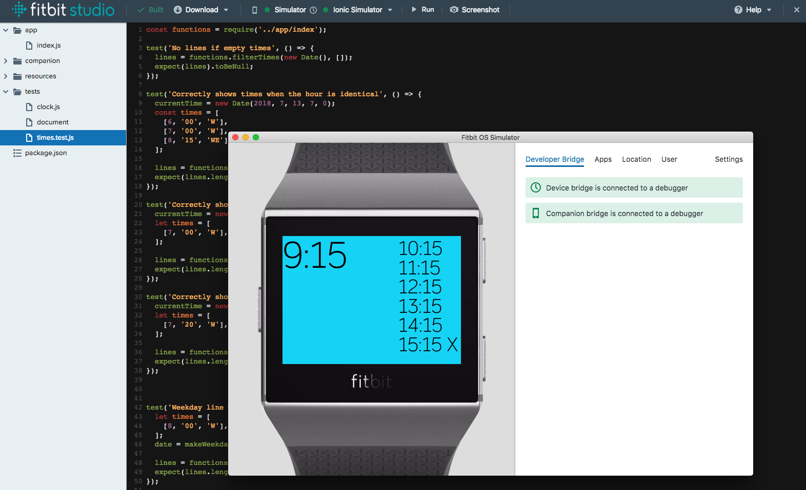
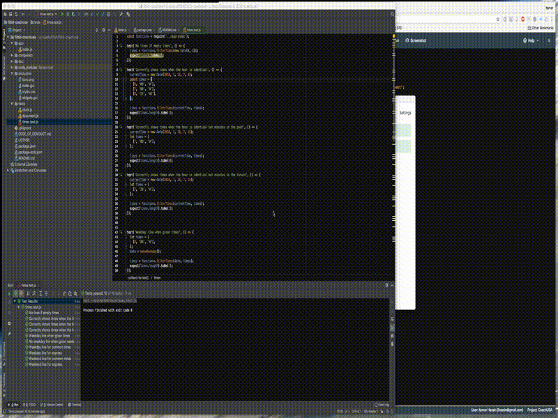

# Fitbit-CoachUSA

A small Fitbit app for the Ionic that displays bus times for me to reference.
The motivation for this project was to see how I could run unit tests when developing, since at the time of writing, the Web-based Fitbit Studio does not lend itself to testing nor to source control and CI processes.

What is CoachUSA? It's a shoddy bus company that I am obliged to use to get to and from NYC. The app shows bus times coming out of NY to where I live. You can ignore the app entirely, and simply concentrate on the tests themselves and file setup.



# Testing

Tests are written in Jest, and can be found in the ```tests``` directory.
Run them by issuing

```bash
JEST=JEST npm test
```

The weirdness with ```JEST=JEST``` is because of some hacks needed to allow the code (including the Jest tests) to be compatible accross you development/testing and production environments.
You'll find references to the environment variable weirdness in ```app/index.js```. It's also explained below in the hope that someone can come up with a better way.

# Development Environment

I use Intellij and run the tests with the ```JEST=JEST``` added in the run configuration when running Jest.

# Environment variable weirdness explained

I wanted the same code for local and Fitbit web-based environments. Needing to reference index.js from the tests directory and noticing that Fitbit does not support some JS directives, I came up with this hack:

```javascript
// Fitbit does not support process
try {
  // Testing environment
  documentPath = process.env.JEST ?  "../tests/document" : "document";
  clockPath = process.env.JEST ? "../tests/clock" : "clock";
} catch(error) {
  // Production environment
  documentPath = "document";
  clockPath = "clock";
}

const document = require(documentPath);
const clock = require(clockPath);

```  
and
```javascript
// Fitbit does not support module
try {
  module.exports = functions;
} catch(error) { }
```
Hack #1: Fitbit does not support ```process``` so the whole thing is in a try-catch.

Hack #2: If I am local, then use the mock ```document``` and ```clock``` modules in the ```tests``` directory, else use the real ones.

Hack #3: If I am in Fitbit, then fail on the ```process``` and look for the modules in their production location.

Hack #4: Fitbit does not support ```module```, so catch it out. 

Make this better!

# In action




# Copying to Fitbit studio

Copy index.js to its right place in Studio.

# Todo

* See if copying the whole directory structure causes any problems to Studio
 

# Licence

Knock yourself out.

# Contributing

Yes please.
